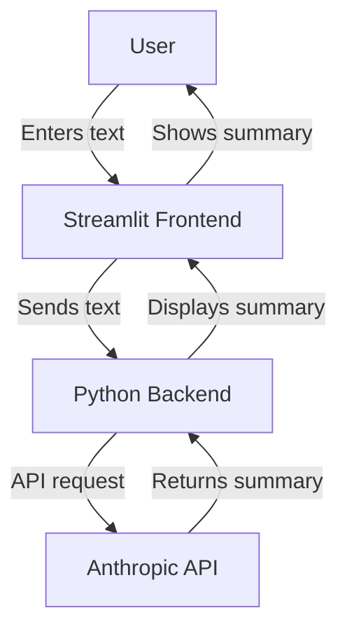

# Text Summarizer Application

## Overview
This is a simple text summarizer application built using Streamlit and Cohere's summarization API. Users can input any block of text, and the application will provide a concise summary.

## Architecture
The application follows a simple architecture:



1. The user interacts with the Streamlit frontend, entering the text to be summarized.
2. The Python backend receives the text and sends a request to the Anthropic API.
3. The Anthropic API processes the text and returns a summary.
4. The Python backend receives the summary and passes it back to the Streamlit frontend.
5. The frontend displays the summarized text to the user.

This architecture ensures a separation of concerns between the user interface, application logic, and the external API service.

## Requirements
- Python 3.7 or later
- An Anthropic API key

## Installation
1. Clone this repository:
   ```bash
   git clone <repository-url>
   cd <repository-folder>
   ```
2. Install the required packages:
  ```bash
  pip install -r requirements.txt
  ```

## Running the Application
1. Set your Anthropic API key as an environment variable:
```bash
export ANTHROPIC_API_KEY='your-api-key'
```
Replace 'your-api-key' with your actual Anthropic API key.

2. Start the Streamlit server:
```bash
streamlit run text_summarizer.py
```

3. Open your web browser and navigate to the local URL provided by Streamlit (usually http://localhost:8501).

## Usage
- Enter the text you want to summarize in the text area and click on the 'Summarize' button.
- The summarized text will appear below the input area.


## License
This project is licensed under the MIT License.
